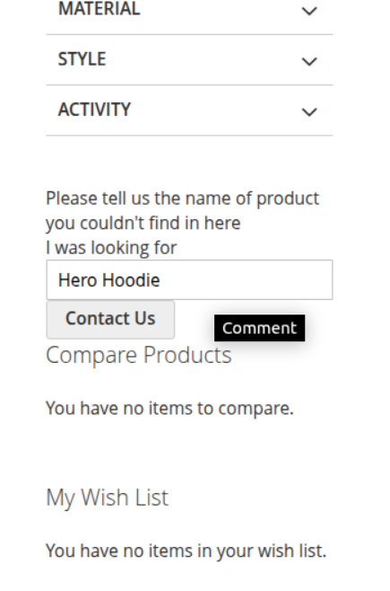
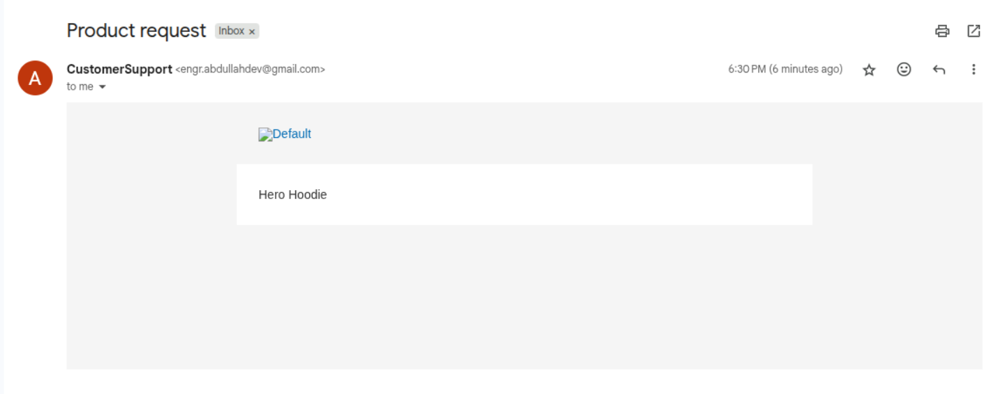

# BugsBunny: Magento 2 Product Request ("Looking For") Module

This Magento 2 extension allows customers to submit the name of a product they couldn’t find on your store.  
It displays a simple, AJAX-based form on key pages such as category, search results, and customer dashboard.  
The submitted product name is sent via email to the configured recipient in the Magento admin panel.

# Features

- Adds a floating **"Looking for a product?"** input form on:
    - Category pages
    - Search results
    - Customer account dashboard
- **Enable/Disable** the module from Magento admin
- Configure **email recipient**, **sender identity**, and **email template**
- Fully responsive and integrates cleanly with any theme
- Uses Magento’s native **configuration**, **email**, and **frontend** systems
- **AJAX-powered** form (no page reload)
- Optional honeypot protection via hidden field

## Configuration

`Stores > Configuration > BugsBunny > Looking For`

# You will find the following options:

- **Active** – Yes/No to enable or disable the form.
- **Send Emails To** – Enter the email address that will receive the form submissions.
- **Email Sender** – Choose the identity used to send the emails.
- **Confirmation Email Template** – Select or customize an email template.

# Example Output Search


# Example Output Email


# Installation

Place the module files under the following directory:
app/code/BugsBunny/Lookingfor

Run the following Magento CLI commands:

```bash
php bin/magento module:enable BugsBunny_Lookingfor
php bin/magento setup:upgrade
php bin/magento setup:di:compile
php bin/magento setup:static-content:deploy -f
php bin/magento cache:clean
php bin/magento cache:flush
